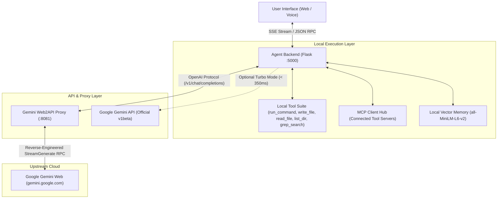
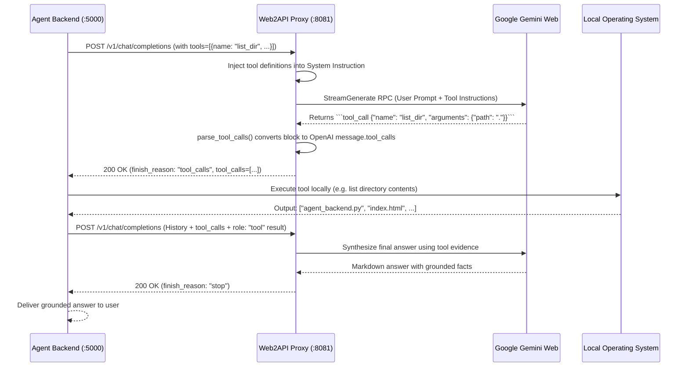

# 🧠 How B1 Gemini Local Agent Works: Architecture & Internal Protocol

This document provides a comprehensive technical breakdown of **B1 Gemini Local Agent**, its reverse-engineered **Gemini Web2API proxy**, the **Native Tool-Calling Bridge**, and the **Autonomous Local Agent Execution Loop**.

---

## 1. High-Level System Architecture

B1 combines a local Apple HIG / Linear-grade web interface with a self-healing Python backend and a zero-authentication Gemini reverse proxy.



---

## 2. The Gemini Web2API Reverse Proxy (`gemini-web2api`)

### How It Connects to Gemini Without API Keys
Google's Gemini Web interface (`https://gemini.google.com`) uses an internal RPC protocol to handle conversational chat via `assistant.lamda.BardFrontendService/StreamGenerate`.

1. **Zero-Authentication Flow**:
   - The stream generation endpoint does not require user cookies for basic text generation or general coding queries.
   - When requests omit session cookies, Google treats the connection as an anonymous guest session.
   - `gemini_web2api` formats payload payloads conforming to the `StreamGenerate` batch format:
     ```python
     inner = [None] * 80
     inner[0] = [prompt, 0, None, None, None, None, 0]
     inner[1] = ["en"]
     inner[17] = [[think_mode]]  # 0=deep reasoning, 4=fast output
     inner[79] = model_id        # 1=Flash, 2=Thinking, 3=Pro, 6=Flash-Lite
     outer = [None, json.dumps(inner)]
     params = {"f.req": json.dumps(outer)}
     ```

2. **Model Selection**:
   The proxy translates standard model identifiers into internal Gemini `MODE_CATEGORY` IDs:
   - `gemini-3.8-flash`: `mode: 1, think: 4` (fastest execution)
   - `gemini-3.8-pro`: `mode: 3, think: 4` (frontier reasoning)
   - `gemini-3.8-flash-thinking`: `mode: 2, think: 0` (extended chain-of-thought)
   - `gemini-3.6-flash`: `mode: 1, think: 4` (stable fallback)

3. **Stream Chunk Decoding**:
   Responses from `StreamGenerate` arrive as chunked envelope arrays (`"wrb.fr"` markers). The proxy extracts delta text slices in real-time, strips internal code execution artifacts, and outputs standard Server-Sent Events (`data: {"choices": [{"delta": {"content": "..."}}]}`).

---

## 3. Native Tool Calling Bridge

Because the public web UI endpoint has no native JSON function-calling schema, `gemini-web2api` and `agent_backend.py` implement a bi-directional translation bridge:



### 1. Schema Injection
When a request containing `tools: [...]` arrives, the proxy compiles the tool definitions into a strict calling protocol:
```
# Tool Use
You can call the following tools to help accomplish tasks.
Call format:
```tool_call
{"name": "<tool_name>", "arguments": {<arguments>}}
```
AVAILABLE TOOLS:
- `run_command(cmd)`: Execute terminal PowerShell commands
- `write_file(path, content)`: Create or update local files
- `read_file(path)`: Inspect file contents
- `list_dir(path)`: List directory files
```

### 2. Regex Tool-Call Parsing
When Gemini generates an invocation, `parse_tool_calls()` identifies and extracts the block:
- Supports ````tool_call`, ````function_call`, and ````json` formats.
- Normalizes parameter keys (`arguments`, `args`, `parameters`).
- Converts the block into an OpenAI-standard `tool_calls` object:
  ```json
  {
    "id": "call_0910ef5f",
    "type": "function",
    "function": {
      "name": "list_dir",
      "arguments": "{\"path\": \".\"}"
    }
  }
  ```
- Sets `finish_reason: "tool_calls"`.

### 3. Execution & Context Loop
`agent_backend.py` receives the structured call, executes the tool safely on the user's machine, appends a message with `role: "tool"`, and calls the proxy again. The model then uses the verified output to craft the final response.

---

## 4. Self-Healing & Resilience Layer

1. **Proxy Auto-Recovery**:
   If port `8081` is down or disconnected, `ensure_proxy_running()` automatically spawns `gemini_web2api.py` as a background process and polls until listening.

2. **Dynamic Baseline BL Discovery**:
   Google periodically rotates backend build numbers (`gemini_bl`). The proxy maintains a verified default (`boq_assistant-bard-web-server_20260920.14_p0`) and uses non-blocking auto-detection with fallback if a `405 Method Not Allowed` occurs.

3. **Autonomous Permissions**:
   Fresh repository clones automatically initialize default local agent permissions (`permissions.json`), ensuring commands and file reads are authorized immediately without blocking automated scripts.

4. **Official Turbo Mode Auto-Switching**:
   If a user adds `GEMINI_API_KEY` to `.env`, `agent_backend.py` switches to Google's official v1beta OpenAI endpoint (`https://generativelanguage.googleapis.com/v1beta/openai/`) and automatically maps model IDs to `gemini-2.0-flash` for sub-350ms response times.

---

## 5. Using B1 with External OpenAI-Compatible Tools

Because `gemini-web2api` implements the standard OpenAI specification, you can connect any third-party AI client directly to `http://127.0.0.1:8081/v1`:

### Python OpenAI SDK
```python
from openai import OpenAI

client = OpenAI(
    base_url="http://127.0.0.1:8081/v1",
    api_key="sk-gemini"  # Or leave empty
)

response = client.chat.completions.create(
    model="gemini-3.8-flash",
    messages=[{"role": "user", "content": "Explain quantum entanglement in 2 sentences."}]
)

print(response.choices[0].message.content)
```

### cURL
```bash
curl http://127.0.0.1:8081/v1/chat/completions \
  -H "Content-Type: application/json" \
  -H "Authorization: Bearer sk-gemini" \
  -d '{
    "model": "gemini-3.8-flash",
    "messages": [{"role": "user", "content": "Hello!"}]
  }'
```
