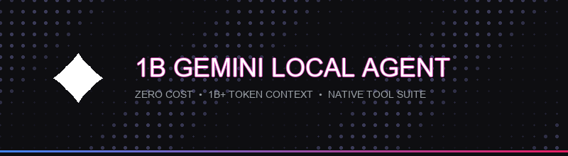

<p align="center">
  
</p>

<p align="center">
  <a href="https://github.com/IshaanYK/1B-gemini-Local-Agent-"></a>
  <a href="https://github.com/IshaanYK/1B-gemini-Local-Agent-"></a>
  <a href="https://github.com/IshaanYK/1B-gemini-Local-Agent-"></a>
  <a href="https://github.com/IshaanYK/1B-gemini-Local-Agent-"></a>
  <a href="https://github.com/IshaanYK/1B-gemini-Local-Agent-"></a>
</p>

---

# 🚀 1B Gemini Local Agent

> **An autonomous, zero-cost AI coding agent powered by Google Gemini (1 Billion+ Token Context), equipped with 6 local system tools, 74 design & engineering skills, Apple HIG UI, live reasoning drawers, and 1-click desktop launching.**

---

## 🌟 Key Features

- **♾️ 1 Billion+ Token Context Window (Zero Cost)**: Powered by Google Gemini via a reverse-engineered Web2API proxy. Unlimited context without per-token charges or credit limits.
- **⚡ 10-Step Autonomous Agentic Loop**: Automatically chains up to 10 consecutive tool actions per turn (`Create file` ➔ `Write code` ➔ `Run PowerShell command` ➔ `Verify output`).
- **💻 6 Native Local System Tools**:
  - `run_command`: Executes PowerShell terminal commands (install packages, build code, run scripts).
  - `write_file`: Directly creates or overwrites local code files on your system.
  - `replace_file_content`: Modifies existing code in-place without rewriting full files.
  - `grep_search`: Searches codebases and workspace files for text queries/patterns.
  - `read_file`: Reads workspace files.
  - `list_dir`: Shallow directory inspection (1-level deep, noise-filtered).
- **🎨 Apple HIG & Linear Glassmorphism UI**:
  - OLED dark mode (`#000000`) with frosted glass panels (`backdrop-filter: blur(25px)`).
  - macOS window control buttons (🔴 🟡 🟢) in sidebar and code header bars.
  - Responsive mobile drawer navigation with tap backdrop overlay.
  - 1-click **Copy** button on all code snippets.
  - Built-in **KaTeX** math engine & text sanitizer for clean shortcut rendering.
- **📚 74 Included Design & Engineering Skills**: Packed with design skills (`design-md-apple`, `design-md-stripe`, `design-md-linear.app`, `design-md-figma`) and technical guides.
- **🔄 Session Handoff Engine (`handoff.py`)**: Seamlessly captures active conversation history from Antigravity/previous sessions so your agent never loses context.
- **🖥️ 1-Click Desktop Launcher**: Launch proxy, handoff context, backend server, and open browser UI in one click via `Launch_Gemini_Agent.bat` or Desktop shortcut.

---

## 🛠️ Local Agent Tool Suite

| Tool | Purpose | Example Directive |
|---|---|---|
| `run_command` | Execute PowerShell commands | *"Run python app.py"* |
| `write_file` | Create or overwrite files | *"Create test.py on Desktop"* |
| `replace_file_content` | Edit code in-place | *"Replace print statement in app.py"* |
| `grep_search` | Search codebase for text | *"Grep for 'call agent'"* |
| `read_file` | Read file contents | *"Read package.json"* |
| `list_dir` | Inspect folder contents | *"Check my Desktop folder"* |

---

## 📁 Repository Structure

```
1B-gemini-Local-Agent/
├── hero_banner.gif               # Animated Hero Banner
├── Launch_Gemini_Agent.bat       # 1-Click Master Desktop Launcher
├── skills/                       # 74 Built-in Design & Engineering Skills
│   ├── design-md-apple/          # Apple HIG Design System
│   ├── design-md-stripe/         # Stripe SaaS Design System
│   ├── design-md-linear.app/     # Linear App Design System
│   └── ...                       # 71 additional specialized skills
├── gemini-chatbox/               # Agent Web Workspace & Backend
│   ├── index.html                # Apple HIG Glassmorphism Web UI
│   ├── style.css                 # Apple OLED dark theme design system
│   ├── app.js                    # SSE streaming, KaTeX & Thought Process UI
│   ├── agent_backend.py          # Python Flask server & 6-tool OpenAI loop
│   ├── handoff.py                # Context transcript extractor & handoff manager
│   └── master_launch.bat         # Terminal launcher script
├── gemini-web2api/               # Reverse-Engineered Gemini Web Proxy Server
│   ├── gemini_web2api.py         # Main OpenAI-compatible proxy server (Port 8081)
│   ├── config.json               # Proxy server configuration
│   └── start_server.bat          # Standalone proxy launch script
└── README.md                     # Project documentation
```

---

## 🚀 Quick Start

### 1. Requirements
- Python 3.8+
- Dependencies: `pip install flask flask-cors openai httpx`

### 2. One-Click Launch (Recommended)
Simply double-click **`Launch_Gemini_Agent.bat`** (or your Desktop shortcut).

It will automatically:
1. Check if `gemini-web2api` proxy is running on port `8081` (and launch it in background if off).
2. Extract and package conversation context (`handoff.py`).
3. Boot up the Agent Backend on port `5000`.
4. Open the Gemini Agent UI directly in your browser.

---

## 🛠️ Manual Start (Optional)

If you prefer to start components manually in separate terminals:

**Terminal 1: Start Web2API Proxy**
```powershell
cd gemini-web2api
python gemini_web2api.py
```

**Terminal 2: Run Agent Handoff & Backend**
```powershell
cd gemini-chatbox
python handoff.py
python agent_backend.py
```

Open `gemini-chatbox/index.html` in your browser.

---

## 🤝 System Architecture

```
┌──────────────────────────┐        SSE Stream        ┌──────────────────────────┐
│   Gemini Web UI          │ ◄──────────────────────► │   Agent Backend (Flask)  │
│   (index.html / app.js)  │                          │   (agent_backend.py:5000)│
└──────────────────────────┘                          └────────────┬─────────────┘
                                                                   │
                                                                   │ 6 Native Tools
                                                                   ▼
                                                      ┌──────────────────────────┐
                                                      │  Gemini Web2API Proxy    │
                                                      │  (gemini_web2api.py:8081)│
                                                      └────────────┬─────────────┘
                                                                   │
                                                                   │ Reverse-Engineered Web RPC
                                                                   ▼
                                                      ┌──────────────────────────┐
                                                      │   Google Gemini Web      │
                                                      │   (gemini.google.com)    │
                                                      └────────────┬─────────────┘
```

---

## 📜 License

MIT License. Free for open-source & personal development.
