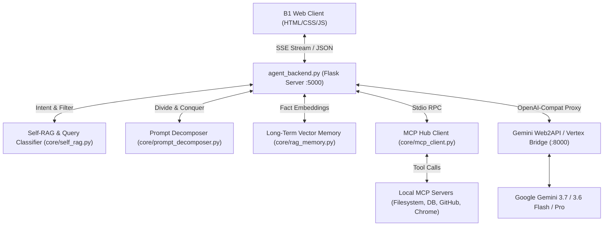

# ✦ B1 Claude Studio — Gemini Autonomous AI Workspace

[](https://github.com)
[](https://linear.app)
[](https://ai.google.dev)
[](https://modelcontextprotocol.io)

**B1 Claude Studio** is a local, high-performance Autonomous AI Workspace and Pair-Programming Studio built with a **Linear-grade dark design**, **live Claude-style interactive artifact drawer**, **Model Context Protocol (MCP) server mesh**, **Self-RAG & Query Validation**, **Deep Prompt Decomposition**, and an **interactive STEM simulation engine**.

---

## 🌟 Key Highlights & Capabilities

### ⚡ 1. Claude-Style Interactive Artifact Drawer & Live Code Sandbox
- **Live Previewing:** Runs single-file HTML/JS/CSS web apps, SVG graphics, D3.js simulations, and interactive tools in an isolated sandboxed `<iframe>`.
- **In-Drawer Monaco-Style Code Editor:** Inspect source code with live syntax highlighting, edit code directly, and re-execute live simulations on the fly.
- **Console Sandbox Bridge:** Captures `console.log`, `console.warn`, and `console.error` from running artifacts and surfaces them in a dedicated real-time debug console tab.
- **One-Click Project Export:** Save artifacts directly to your local project folder or download as `.html`/`.py`/`.js`.

### 🧠 2. Self-RAG, Intent Disambiguation & Unclear Prompt Normalization (`core/intent_disambiguator.py`)
- **Messy & Unclear Prompt Resolution:** Automatically normalizes typos, dev slang, phonetic misspellings, and broken grammar (e.g., `"vishualize quadratic air drag motion with slidders and shwo maths equation"`).
- **Contextual Coreference Resolution:** Inters conversational pronouns (*"it"*, *"that"*, *"the button"*, *"preview this"*) against recent conversation turns and active workspace files.
- **Explicit Assumptions & Intent Banner:** Renders a sleek **"✦ Intent Understood"** banner with formulated engineering assumptions before execution.
- **Query Verification Engine (`core/self_rag.py`):** Automatically classifies incoming queries into execution modes (*Conversational, Code Generation, STEM Visualization, Deep Research, MCP Tooling*).
- **Proactive STEM Visualization Offers:** B1 intelligently identifies queries suited for simulation and presents interactive **"Visualize It"** offer cards before rendering full-canvas physics/math engines.
- **Vector & SQLite Fact Store (`core/rag_memory.py` & `core/memory_manager.py`):** Multi-tiered memory maintaining conversation history, user preferences, codebase entities, and retrieved context.

### 🔌 3. Model Context Protocol (MCP) Hub (11+ Servers, 97+ Tools)
- Full client integration with local and remote MCP servers (`mcp_client.py`).
- Pre-configured presets for **Filesystem**, **PostgreSQL**, **GitHub**, **Puppeteer / Playwright**, **Memory / Knowledge Graph**, **Brave Search**, and **Google Cloud**.
- Interactive UI to inspect connected servers, trigger tool executions, add custom stdio/SSE transports, and import raw JSON configs.

### 📐 4. Mathematical Typesetting (KaTeX) & System Diagrams (Mermaid)
- **True LaTeX Math Rendering:** Display formulas `$$...$$` and inline notation `$F=ma$` rendered with high precision and auto-scrolling overflow wrappers.
- **Mermaid Flowcharts & Sequences:** Live rendered sequence diagrams, class trees, and cloud architecture cards with one-click source copy.

### 👥 4. Multi-Agent Specialist Council (6 Persona Roles)
- ⚡ **Fullstack Engineer**: Frontend design, React/HTML/JS artifacts, algorithmic efficiency, and debugging.
- 🏗️ **System Architect**: C4 architecture diagrams, microservices, PostgreSQL/SQLite schemas, and RBAC security models.
- 🔬 **STEM & Physics Simulator**: Numerical calculus, Euler-Cromer drag mechanics, chaos theory, and 3D Canvas visualizers.
- 🛡️ **Security & Red Team**: OWASP vulnerability audits, JWT token rotation, CORS enforcement, and secret protection.
- 🔍 **Deep Web Researcher**: Autonomous multi-source internet research, technical documentation scraping, and synthesis.
- 👁️ **Vision & Webcam ML Engineer**: In-browser Computer Vision, real-time webcam processing (`navigator.mediaDevices.getUserMedia`), hand/color centroid tracking, motion differencing, and reactive particle physics.

### 📁 5. Workspace Codebase Explorer & Live File Editor
- **Hierarchical Directory Tree:** Browse local project files, subfolders, codebases, and databases with collapsible tree navigation.
- **In-Drawer File Inspection:** Click any file to open it directly in the editor pane with syntax highlighting.
- **1-Click Semantic RAG Indexer:** Ingest entire local repositories directly into long-term vector memory.

### 💻 6. Integrated Live Workspace Terminal
- **Interactive PowerShell & Shell Runner:** Execute command-line tasks, Python scripts, git commits, and test suites directly from the Artifact Drawer dock.
- **Live Output Stream:** Colored stdout and stderr formatting with exit code tracking.

### 🌐 7. Live Web Search & Scraping Agent
- **Real-Time Web Search Tool (`web_search`):** Query the live internet for current documentation, GitHub repositories, and breaking APIs.
- **Clean Markdown Extraction (`fetch_webpage_markdown`):** Fetch any public URL and convert its content into structured Markdown.

### 🎯 8. Personalization & Interactive Onboarding
- **Interactive Multi-Step Onboarding:** Personalizes communication style, persona archetype, developer role, and theme preference.
- **Persistent Perception Matrix:** Remembers user identity and workspace conventions across reboots in `user_profile.json`.

### 🛡️ 10. Automated Codebase Security & OWASP Audit Engine (`core/security_rag.py`)
- **1-Click Static Vulnerability Scan:** Scan your active workspace for hardcoded API keys, JWT secrets, potential SQL injection concatenations, and IDOR vulnerabilities.
- **OWASP RAG Integration:** Queries built-in CWE/OWASP knowledge stores to generate targeted remediation checklists.
- **Dedicated Interactive Audit Modal:** Inspect findings with severity badges, line-by-line code snippets, and live re-scanning.

### 🧩 11. Prompt Engineering Blueprint Studio
- **Curated Prompt Blueprints:** 1-click load high-precision prompts for Architecture Blueprints, STEM Projectile Simulations, OWASP Audits, 8-Bit Synthesizers, and Fourier Epicycles.
- **Modal Library:** Filter prompts by category with dark UI cards.

### ⚡ 12. App Integrations & Autonomous Workflow Hub (`core/automation_engine.py`)
- **Installed Software Detection:** Discovers local developer tools on the system (VS Code, Git, Python, Node.js/NPM, PowerShell, Docker Desktop).
- **1-Click External App Launching:** Automatically opens the active workspace in VS Code, Git GUI, or native terminals.
- **Multi-Stage Autonomous Pipelines:** 1-click executes chained workflows (e.g. *Workspace Environment Doctor*, *Automated Security & Code Health Scan*, *Git Autonomous Sync & Commit*) with live execution log streams.
- **Custom App & Step-by-Step Workflow Builder:** Register any local executable, CLI tool, or service with custom emojis, categories, and interactive sequential instructions (`$ command | instruction`) with individual `[▶ Run]` buttons or 1-click `[▶ Run All Steps]` execution.

### 💬 13. WhatsApp & Social Messaging Connectors (`core/messaging_engine.py`)
- **WhatsApp Integration:** Dispatches notifications via Meta WhatsApp Cloud API or direct WhatsApp Web/Desktop protocol deep links (`wa.me`).
- **Telegram Bot Dispatcher:** Automated broadcast of security audit reports, build status, and task completions to private chats or public channels.
- **Discord & Slack Webhooks:** Posts rich embed cards and team status updates to specified channel webhooks.
- **Dynamic Custom Messaging & App Extensibility:** Register any custom chat app, service, or webhook (Microsoft Teams, Signal, Matrix, Pushover, WeChat, Zapier, N8N) supporting Webhook POST, DeepLink URL schemes, or CLI commands with custom step-by-step connection guides.
- **1-Click Message Dispatcher:** Send instant test alerts directly from the Automations Hub to any built-in or custom registered messaging app.

### ☁️ 14. Conversational File Sharing, Google Drive Upload & AI Message Suggestions
- **Natural Language Intent Parsing (`core/sharing_intent_engine.py`):** Talk to B1 naturally (*"send this document to Alex on WhatsApp"*, *"upload these files to my Google Drive"*, *"suggest what message I should write"*).
- **Google Drive Cloud Sync Engine (`core/drive_engine.py`):** Automatically syncs and uploads local artifacts, codebase documents, and scripts to Google Drive with generated cloud viewing links (`/api/drive/upload`).
- **Interactive Linear-Style Action Cards:** Renders in-chat actionable cards with attached file chips, 3 click-to-apply AI suggested message variations (Friendly, Professional, Technical Summary), editable captions, and 1-click `[🚀 Send to WhatsApp]` or `[☁️ Upload to Google Drive]` buttons.

---

## 🏗️ Architecture Overview



---

## 📁 Repository Structure

```
gemini-chatbox/
├── 📄 index.html              # Main single-page studio application
├── 🎨 style.css               # Complete Linear-grade theme and component design system
├── ⚡ app.js                  # Frontend controller (Artifacts, KaTeX, Markdown, SSE, Events)
├── 🐍 agent_backend.py        # Central Flask agent backend with tool calling & streaming
├── 🚀 launch_all.py           # Multi-process orchestrator (starts proxy, backend & web server)
├── 📦 master_launch.bat       # Windows 1-click startup script
│
├── 📂 core/                   # Core agentic runtime engines
│   ├── self_rag.py           # Intent detection, query validation & visualizer triggers
│   ├── prompt_decomposer.py  # Multi-stage task breakdown & execution planner
│   ├── rag_memory.py         # SQLite + Vector embedding retrieval engine
│   ├── memory_manager.py     # Session state & long-term episodic memory
│   └── mcp_client.py         # MCP protocol bridge & JSON-RPC dispatcher
│
├── 📂 playground/             # Isolated sandbox workspace for code & generated scripts
├── 📂 storage/                # SQLite databases (chat_sessions.db, vector_memory.db)
└── 📂 uploads/                # Attached images, documents, and user uploads
```

---

## 🚀 Getting Started

### Prerequisites
- **Python 3.10+**
- **Node.js 18+** *(optional, for running `npx` MCP servers like filesystem/github)*
- Google Gemini API Key (or active local proxy daemon)

### 1. Install Dependencies
```bash
pip install flask flask-cors requests beautifulsoup4
```

### 2. Launch Workspace
Run the automated orchestrator to start the API bridge, backend agent, and HTTP server simultaneously:

```bash
# Windows
master_launch.bat

# Or run directly via Python
python launch_all.py
```

Open your browser to:
```
http://localhost:8080/index.html
```

---

## ⌨️ Productivity Hotkeys & Shortcuts

| Shortcut | Action |
| :--- | :--- |
| <kbd>Ctrl</kbd> + <kbd>K</kbd> / <kbd>Cmd</kbd> + <kbd>K</kbd> | Open **Global Command Palette** (STEM sims, themes, tools, exports) |
| <kbd>Ctrl</kbd> + <kbd>B</kbd> / <kbd>Cmd</kbd> + <kbd>B</kbd> | **Toggle Sidebar Panel** (Collapse / Expand) |
| <kbd>Enter</kbd> | Send Message |
| <kbd>Shift</kbd> + <kbd>Enter</kbd> | Insert Line Break in Input |
| <kbd>Ctrl</kbd> + <kbd>V</kbd> | Paste Image / Clipboard File (uploads automatically) |
| <kbd>Esc</kbd> | Close Modals / Command Palette / Dialogs |

---

## 🔬 Built-In Interactive STEM Visualizer Suite

Type or trigger any of the following interactive physics and math sandboxes from the Command Palette (<kbd>Ctrl</kbd>+<kbd>K</kbd>):

1. **2D Projectile Motion Sandbox:** Euler-Cromer numerical integration with quadratic drag, air density, wind velocity, and launch angle sliders.
2. **Fourier Series & Epicycles:** Dynamic phasor decomposition synthesizing square, triangle, and sawtooth waves with harmonic control.
3. **2D Gradient Descent Optimizer:** Real-time contour plot displaying learning rate convergence, saddle point escapes, and momentum.
4. **Lagrangian Double Pendulum:** Chaotic trajectory trails with real-time angular velocity and length sliders.
5. **Retro 8-Bit Synthesizer:** 16-step matrix sequencer with Web Audio API, ADSR envelope, customizable waveforms, and live FFT visualizer.

---

## 🔌 Connecting Custom MCP Servers

You can register custom MCP servers either via the UI (**Top Bar → MCP Hub**) or by adding entries to `mcp_servers.json`:

```json
{
  "mcpServers": {
    "my-tools": {
      "command": "npx",
      "args": ["-y", "@modelcontextprotocol/server-filesystem", "C:/Users/username/Projects"],
      "env": {}
    }
  }
}
```

---

## 🛡️ Privacy & Permissions
B1 features a local **Security & Permission Gate** (`permissions.json`). File operations, command executions, and web crawls outside safe boundaries prompt for interactive user authorization.

---

*Engineered with 💜 using Google Gemini and Linear UI design principles.*
